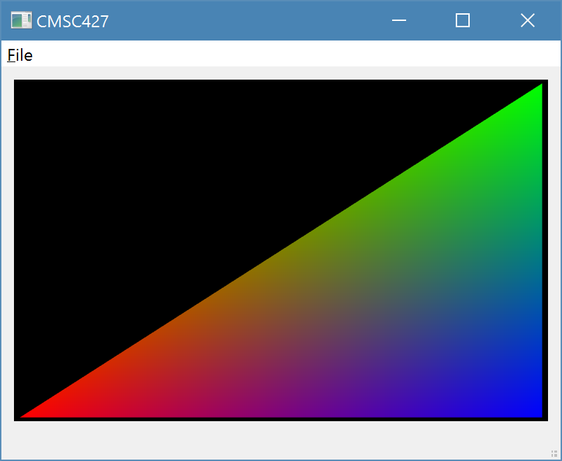
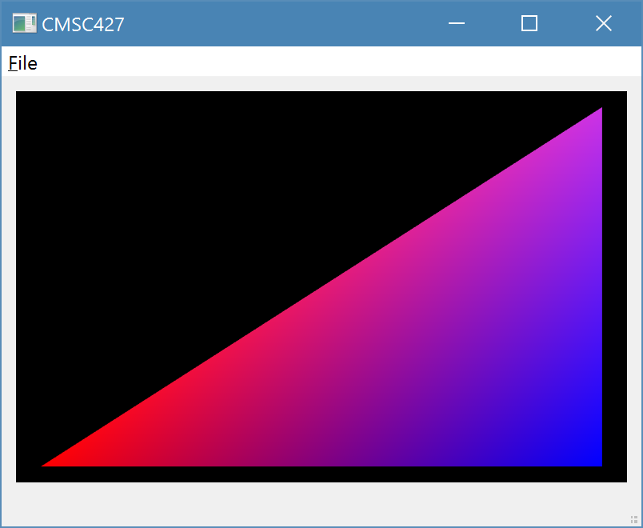
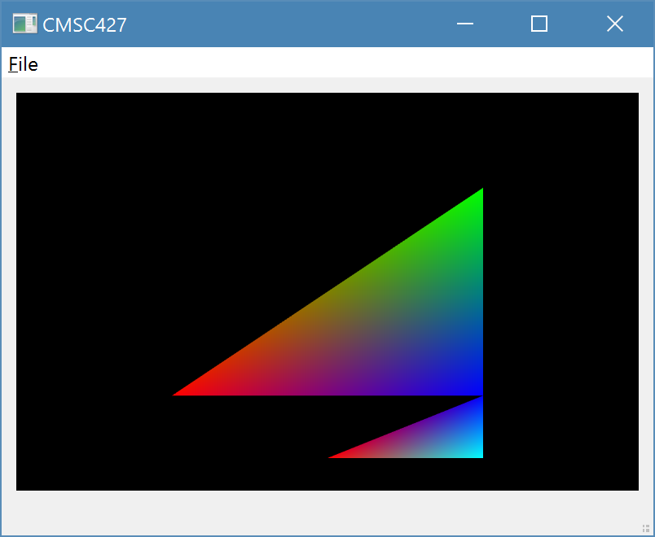
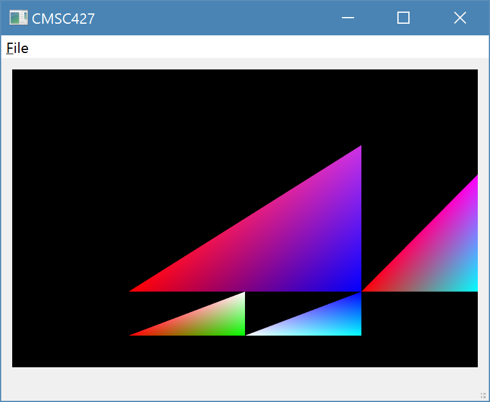
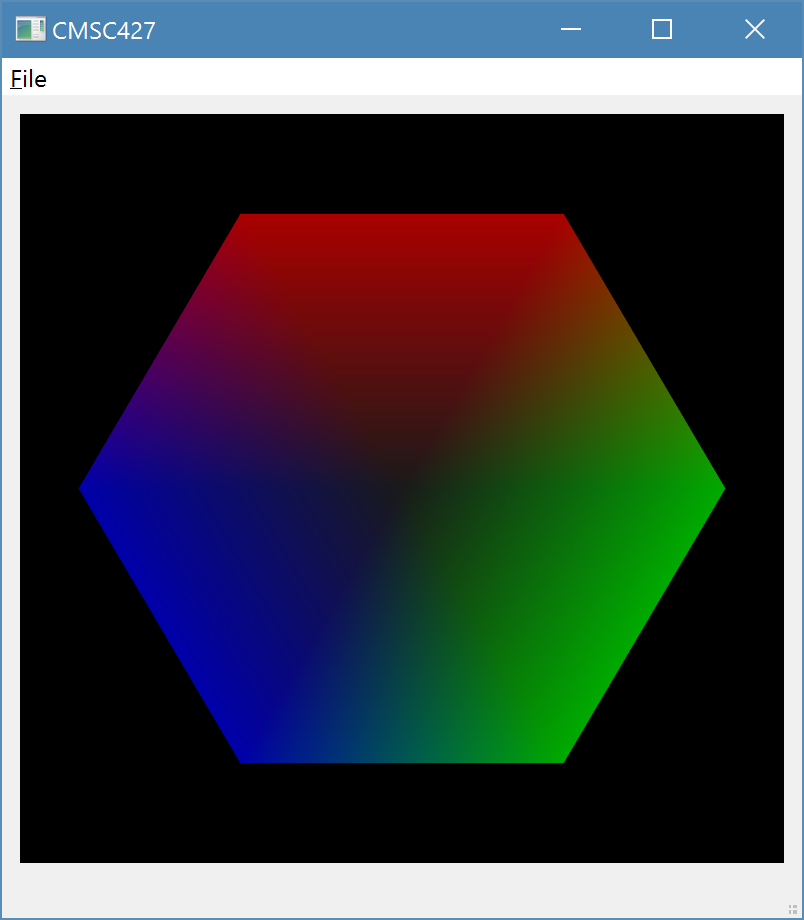
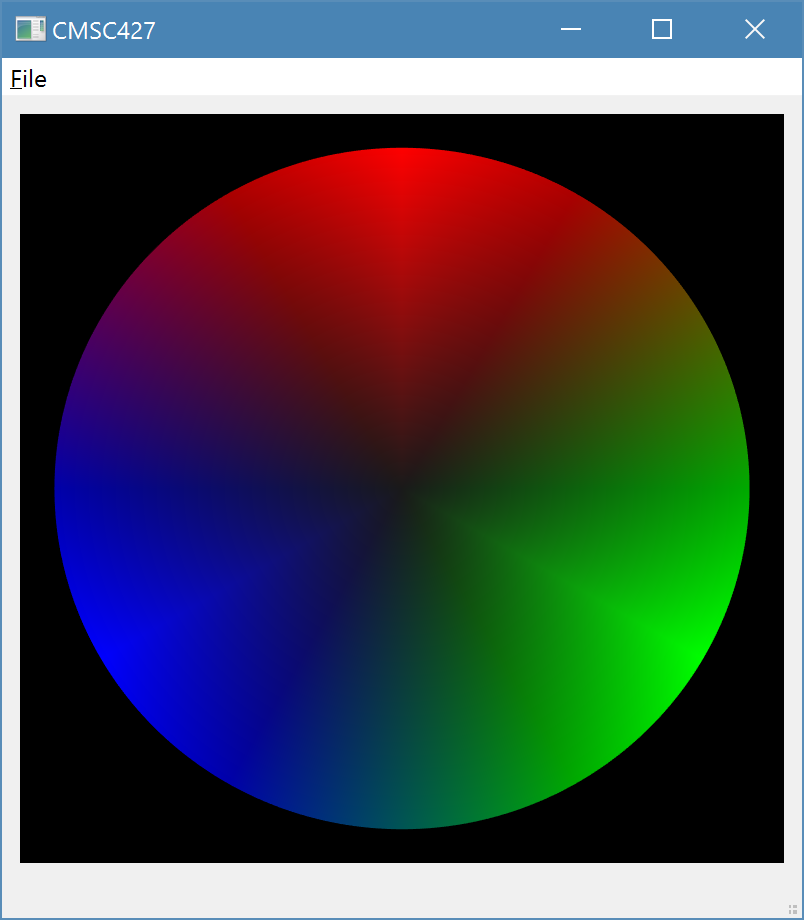

# CMSC427 Programming Assignment 1
Kyle Herock

## HelloWorld2D
1. The `main` method can be found on line 39 of `cmsc427.cpp`.
2. `CMSC427Win` inherits from the `QMainWindow` and `Ui::CMSC427Win` classes.
	`GLview` inherits from the `QOpenGLWidget` and `QOpenGLFunctions` classes.
3. `glwidget` is a `GLview` that gets initialized in the `Ui_CMSC427Win` class
	from `ui_cmsc427.h` (namespaced under `Ui` as `Ui::CMSC427Win`).
4. `GLview::timerEvent()` is called every 15 milliseconds.
5. `GLview::initializeGL()` is called once before the first `paintGL()`
	(or `resizeGL()`).
6. `GLview::paintGL()` is called when the widget needs to be updated, usually
	every frame.
7. `g_objScale` gets updated with the timer event every 15 ms. The relevant
	math is
	```
	seed += 0.05;
	g_objScale = 0.5 * qSin(seed) + 1;
	```
8. _see `simple.fsh`_

## minimalGL\_2D\_twoTriangles
9. Keeping the same signs, the new x,y coordinates are at 2/3.
	(_see `GLview.cpp`_)
10. By setting the second vertex to nearly magenta, there isn't much green in
	the triangle anymore.  
	
	
11. The coordinates of the vertices' x coordinates are no longer scaled, so it
	only stretches vertically.
12. _see `GLview.cpp`_  
	
	
13. I was able to generalize the logic in `moreTriangles()` to generate a
	circle made of `n` triangles and seamlessly blend the three additive
	primaries. Here's one with just 6 triangles:

	

	Here's one with *6000*!  
	
