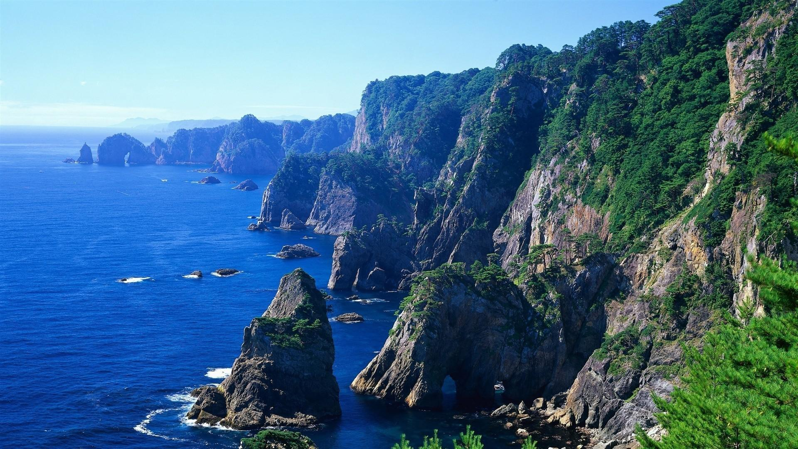

# Programming Assignment 2
Kyle Herock

Image before operations are applied:

### Luminance Operations
Implemented:
* Brightnesss: Change the brightness of the image by a real-valued alpha factor.
  Accomplished by multipling each pixel's RGB values by the factor.
  * The alpha factor can be any value in the range [0.0, 2.0]  
  Brightness 1.5:  
  
  Brightness 0.2:  
  
  
* Contrast: Change the contrast of an image by a real-valued alpha factor.
  Accomplished adding the factor multiplied by each pixel's distance from the average luminance.
  * The alpha factor can be any value in the range [-1.0, 2.0]  
  Contrast 2.0:  
  
  Contrast -0.7:  
  

### Color Operations
Implemented:
* Black & White: Convert to gray levels by replacing each pixel with its perceived luminance.
  * Accomplished with a call to Saturation with a factor of 0  
  
  
* Saturation: Change the saturation of an image using a specified saturation factor. 
  * The saturation factor can be any value in the range [-1.0, 2.5]  
  Saturation 2.0:  
  
  Saturation -0.6:  
  

### Filtering Operations
Implemented:
* Channel Extract: Leave the specified channel intact and set the other 2 channels to zero.
  Accomplished by applying a bit mask that isolates either the R, G, or B channels while preserving alpha.
  Red:  
  
  Green:  
  
  Blue:
  
* Motion Blur: Apply a left-right linear blur to the image given a positive real-valued sigma.  
  Sigma 20:  
  
* Sharpen: Apply a linear sharpening filter to the image. A [-1 -1 -1; -1  9 -1; -1 -1 -1] transformation
  matrix is used.
  * Uses a radius of 1 pixel (3x3 kernel)  
  
  
### Translation Operations
Implemented:
* Rotate: Rotate an image around the center by a given angle
  * The angle can be any real-value in the range [0, 360]
  * Regions of the new image that do not have image data are set to black  
  Rotated 50 degrees (bilinear):  
  
* Scale: Scale an image up or down in the x and y direction by a real valued factor
  * The factor can be any value in the range of [0.05, 20]  
  Scaled 10x7.8 (point):  
  
Both of these operations can use any of 3 sampling operations: point (nearest neighbor), bilinear, and Gaussian.
By default, point sampling is used.

### Transformation Operations
Implemented:
* Crop: Remove the outer part of an image. Regions outside the image region are filled with black.  
  Cropped 400x400 at offset (1450, 800):    
  
