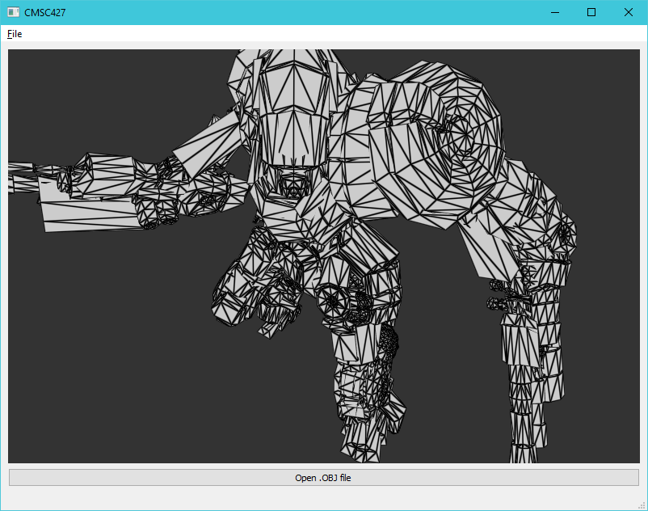
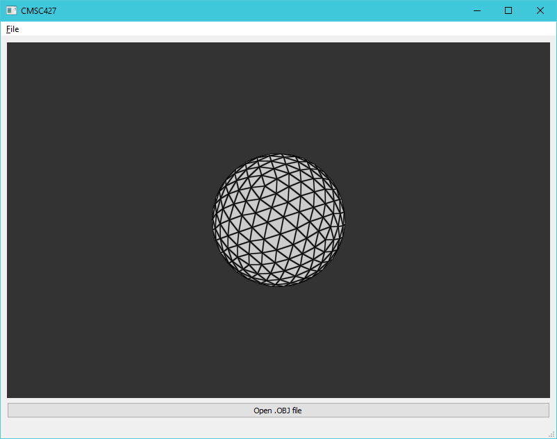
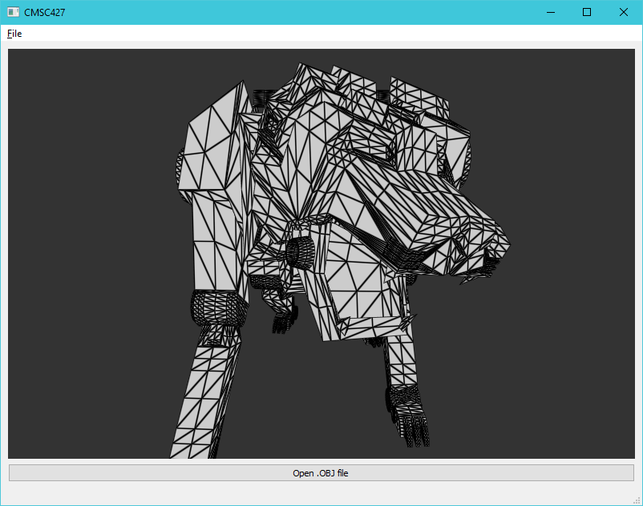

# Programming Assignment 3
### CMSC427 - Dr. Zia Khan
Kyle Herock

## Analysis
(The results of these operations are demonstrated in _Warps_)
* **Compute average edge lengths and computing per-vertex normals**:  
  The implementation of these operations required using a data structure that
  allows O(K) access to both edges and faces attached to each vertex. I chose
  to use doubly-linked references between vertices and faces to allow this.
  This allows for cheap enumeration of vertices and edges but operations such as
  flipping edges become expensive because of all the references that need to be
  updated.

  Computing the average edge length simply uses `QVector3D::length()` and
  `QVector3D`'s overloaded arithmetic operators to get average distance between a
  vertex and its neighbors.

  Vertex normals are computed by summing each adjacent face's cross product and
  weighting its magnitude with the area of the face.
  [Heron's formula](https://en.wikipedia.org/wiki/Heron%27s_formula) is applied
  on the edge lengths fo find the area of the face. The final sum is then
  normalized and stored.

## Warps
* **Inflate**:  
  Each vertex is iteratively extended along its normal by a distance determined by
  the product of the inputted factor and the average vertex normal.  
    
  Factor: 0.6  
  
* **Random noise**:
  Each vertex is iteratively displaced in a random direction by a random distance
  between 0 and the inputted factor times the average vertex length.  
    
  Factor: 1.2  
    

## Filters
* **Smooth**:  
  For each vertex, it and each of its neighbors are passed through a Gaussian with
  a sigma of its average edge length. The final set of coordinates are divided by
  the total weight of all edges so that they sum to 1.
    
    
* **Sharpen**:
  Performs the same operations on each vertex as smooth but in the opposite direction,
  away from the weighted average of each vertex's neighbors.

    
  (3 passes)
    

## Remeshing
* **Split faces**:  
  Each face is iteratively split into 4 triangles by splitting edges at the midpoints
  between vertices. Since midpoints are shared between faces, an unordered map using
  Knuth's multiplicative hash of the lower-indexed vertex with a neighboring vertex
  as keys and the resulting midpoint as values is used. 3 new faces are created while
  the existing face is modified to become the new center face.

    
    

* **Split long edges** (longer edges are split first):  
  Every edge larger than 4/3rds the average edge length of either connected vertex is
  split until none larger than the original set of average vertex lengths remain.
  Originally, edges were resorted using insertion sort after every iteration, but this
  proved too costly as the vertex count grew very large. Insertion sort was chosen
  since it has good performance with mostly sorted lists.

  When an edge is split, a new edge is created from the midpoint to the opposite since
  of the existing face. The face is then modified to span half the original area and
  new one is inserted in the gap created.

    
  (2 passes)
    

## Subdivision
* **Loop subdivision**:
  This borrows most of its implementation from split faces. When a midpoint is added
  (an odd vertex) its position is computed using a saved version of the original
  vertex list. After midpoints and the new faces are created, the original (even)
  vertex positions are computed according to Warren's method for choosing β.

    
  (3 passes)
    

## Extra credit
* **Flip edges**:
  This iterates over every vertex in 3 passes. For each vertex with a degree greater
  than 6, a pair of adjacent faces are randomly chosen to flip an edge across. Each
  face is modified with an updated set of vertices, and the vertices involved are each
  relinked to have the correct adjacent edge and face references.  
    
  (3 passes)
    
