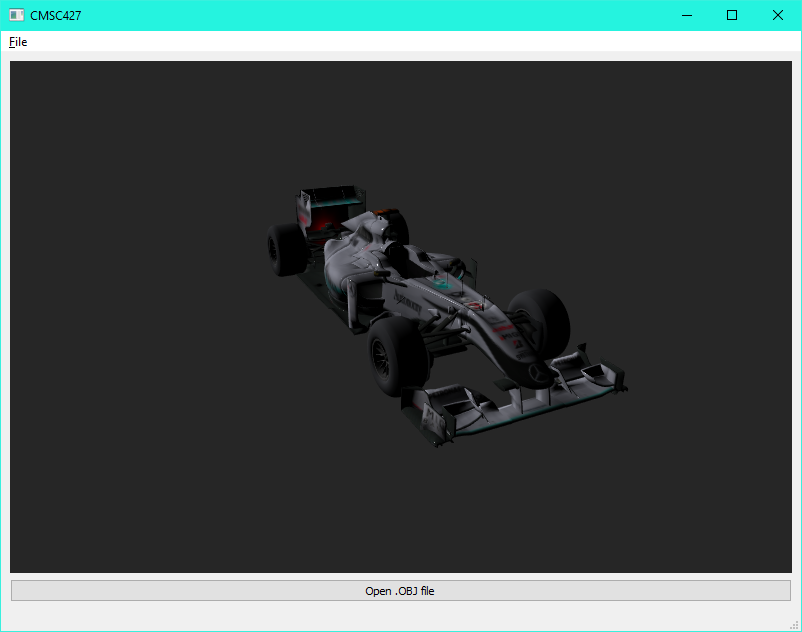

# Programming Assignment 4
### CMSC427 - Dr. Zia Khan
Kyle Herock

## Camera Parameter Animations
* Animate FOV parameter:  
  For this and several animtions, I created a `SinAnimator` class which holds the state
  of animatible parameters that change on every tick. For this parameter I made `yfov`
  animate smoothly between 20 and 100 degrees every 2 time units.  
  Lower FOVs reduce the amount of distortion at the edges of the image and makes the
  camera appear closer to the subject.  
    
  Lower FOV:  
  
* Animate near plane:  
  I created another `SinAnimator` that animates `neardist` between 1 and 5 every 4 time
  units. This omits geometry less than `neardist` units away from the camera orthogonally.  
    
  
* Animate far plane:  
  This animates `fardist` in the same manner as the near plane. This changes the threshold
  of when geometry farther than `fardist` units away from the camera are omitted.  
    
  
* Animate camera:  
  This rotates the camera about the look center in the look up direction.

## Materials
* Cycle through each material:  
  This isolates triangles belonging to a certain material and prints the name of the material
  in a dialog box.  
    
  
* Animate material:  
  This animates the vertices of the selected material up out of the plane of the car and back down.  
    
  

## Groups
* Cycle through each group:  
  This isolates triangles belonging to a certain group and prints the name of the group
  in a dialog box.  
    
  
* Animate wheels:  
  This animates the wheel groups so that they rotate as if the car is moving forward.  
    
  
* Animate swerving (Incomplete implementation):  
  This rotates the wheel groups about (0, 0, 1) and moves the car in a figure eight pattern.  
    
  
