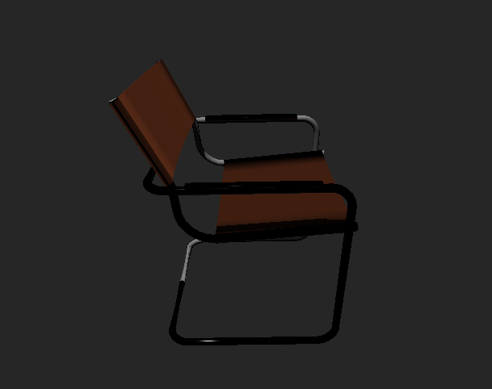
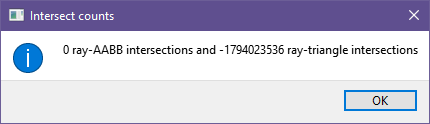
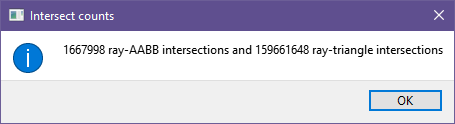
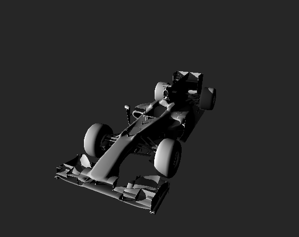
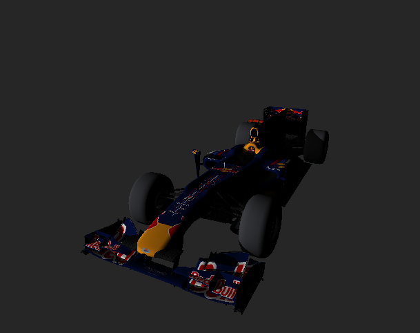
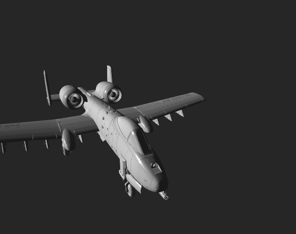
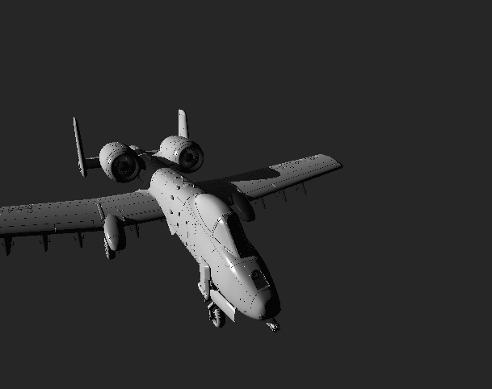

# Programming Assignment 5
### CMSC427 - Dr. Zia Khan
Kyle Herock

## Bounding Volume Hierarchy + Surface Area Heuristic
When Implementing BVH, I found that creating deep hierarchies where leaves were very small was almost as inefficient as just letting the intersections run on all triangles. I ended up using leaves of size <= `n / ln(n)`, where n is the total number of triangles. All three modes successfully produce the same output:

`t` for Evaluate All Triangles: 35.0369s  
  
(The number of intersections actually overflows into the negative range!)

`t` for BVH: 2.672s  
  

1495760 + 231946350 = 233442110 total intersections

`t` for BVH + SAH: 3.574s  
  
1667998 + 159661648 = 161329646 total intersections (72,112,464 fewer intersections than plain BVH)

My SAH implementation is usually not as performant as the plain BVH implementation, but there are always fewer total intersections. It is at least usually within 1 second.
Since there significantly fewer intersections, if the BVH were to preserved across
multiple renders, it would outperform plain BVH proportionally to the number of of
intersections saved.

The disparity in performance is likely because the way I calculate the AABBs for each
partition scenario could be better optimized.

## Textures
My texture mapping implementation modified the signature of `Mesh::check_intersect` to
use an `interpolated_uv` argument to set the appropriate (`u`, `v`) when an inersection
was found. `u` is scaled to the texture width and `v` is scaled to the texture height.
Values that scale out of the range of the texture image are simply ignored.

Once a pixel is found, its color values are scaled from [0 255] to [0 1] when assigning it to
`Kd`.

  
Without textures, the default background color is used to calculate all the pixel values.

## Shadows
To implement shadows, I decreased the variable for light intensity by a factor of 5 (20%)
if the ray originating from the intersection toward the light direction intersected any other triangles.
I chose to offset the ray by an epsilon of 1e-6 to avoid noisy artifacts in the render.

  
Note: The above is how the object appeared in the application window.

